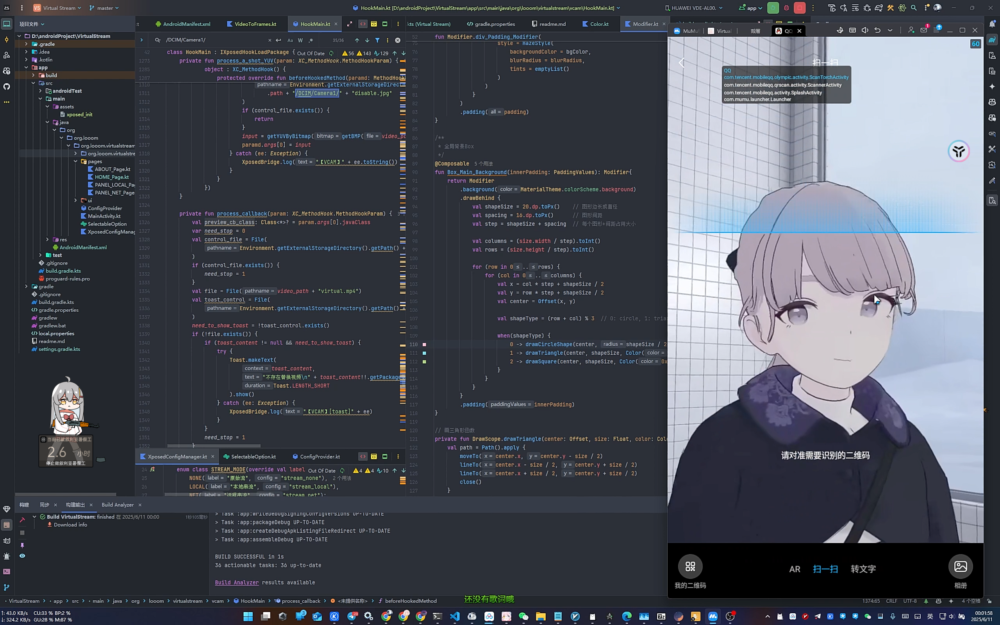

# virtual stream
安卓(12-16)的虚拟串流摄像头xposed模块，他可以选择本地视频文件，也可以接收RTMP/RTSP串流媒体

[演示视频](./media/demo.mp4)

|||
|--|--|
|||

# 窝滴安卓结课啦
窝滴安卓结课啦,这软件交作业了，不再开发了

# 三方库及兼容性说明

| 库名及链接 | 用途     | 兼容性              |
|-------|--------|------------------|
| [Haze](https://chrisbanes.github.io/haze/latest/)  | 组件高斯模糊 | 安卓12及以上(sdk>=31) |

# 使用说明
开发中，未完待续
